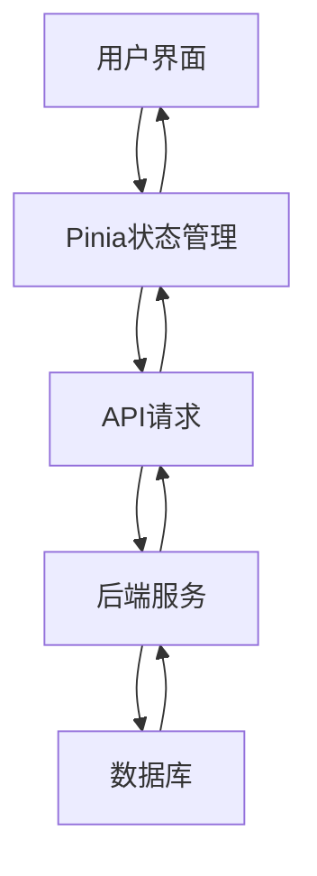

# 邻里绿链系统 Web 前端架构设计

## 项目概述

基于现有的用户界面设计文档和后端API接口，实现物业管理端的Web前端系统。

## 技术选型

### 前端框架
- **Vue 3** - 现代化的响应式框架
- **TypeScript** - 提供类型安全
- **Vite** - 快速的构建工具

### UI组件库
- **Element Plus** - 基于设计文档中提到的Element Plus组件
- **Pinia** - 状态管理
- **Vue Router** - 路由管理

### 样式方案
- **SCSS** - CSS预处理器
- **Tailwind CSS** - 实用类优先的CSS框架

## 项目结构

```
src/
├── assets/                 # 静态资源
│   ├── images/
│   └── styles/
├── components/             # 通用组件
│   ├── common/            # 通用UI组件
│   ├── layout/            # 布局组件
│   └── forms/             # 表单组件
├── views/                 # 页面视图
│   ├── auth/              # 认证相关页面
│   ├── dashboard/         # 控制台首页
│   ├── users/             # 住户管理
│   ├── coins/             # 绿币管理
│   ├── community/         # 社区互助
│   └── settings/          # 系统设置
├── stores/                # Pinia状态管理
│   ├── auth.ts
│   ├── users.ts
│   ├── coins.ts
│   └── common.ts
├── utils/                 # 工具函数
│   ├── api.ts             # API请求封装
│   ├── auth.ts            # 认证工具
│   └── validators.ts      # 表单验证
├── types/                 # TypeScript类型定义
│   ├── api.ts
│   ├── user.ts
│   └── common.ts
├── router/                # 路由配置
├── App.vue
└── main.ts
```

## 核心功能模块

### 1. 认证模块 (Auth)
- **Admin Login Portal**: 管理员登录界面
- **权限验证**: 基于JWT的认证机制
- **路由守卫**: 保护需要认证的页面

### 2. 控制台首页 (Dashboard)
- **数据概览**: 社区互助概况
- **快速入口**: 各功能模块导航
- **实时数据**: 关键指标展示

### 3. 住户管理模块 (User Management)
- **User Audit Management UI**: 住户审核管理
- **数据表格**: 待审列表展示
- **审核操作**: 批量审核功能

### 4. 绿币管理模块 (Coin Management)
- **Coin & Fee Management UI**: 绿币与物业费管理
- **规则配置**: 抵扣规则设置
- **账单管理**: 费用抵扣记录

### 5. 社区互助模块 (Community)
- **Community Interaction Monitor UI**: 社区互助监视
- **实时监控**: 互助交易和求助状态
- **地图展示**: 社区互助地图

### 6. 系统设置模块 (Settings)
- **Settings & Announcement UI**: 系统设置与公告
- **用户管理**: 人员权限配置
- **公告发布**: 社区公告管理

## 数据流设计



## API集成计划

### 1. 认证相关API
- `POST /api/auth/login` - 管理员登录
- `POST /api/auth/refresh` - 刷新token
- `POST /api/auth/logout` - 登出

### 2. 住户管理API
- `GET /api/users/pending` - 获取待审住户列表
- `POST /api/users/approve` - 审核通过
- `POST /api/users/reject` - 审核拒绝

### 3. 绿币管理API
- `GET /api/coins/rules` - 获取抵扣规则
- `POST /api/coins/rules` - 创建抵扣规则
- `GET /api/coins/transactions` - 获取交易记录

### 4. 社区互助API
- `GET /api/community/interactions` - 获取互助数据
- `GET /api/community/emergencies` - 获取紧急求助状态
- `GET /api/community/map` - 获取社区地图数据

### 5. 系统设置API
- `GET /api/settings/announcements` - 获取公告列表
- `POST /api/settings/announcements` - 发布公告
- `GET /api/settings/users` - 获取用户列表
- `POST /api/settings/users` - 创建用户

## 开发计划

### 第一阶段：项目搭建
1. 创建Vue 3 + TypeScript项目
2. 配置Vite和开发环境
3. 安装必要的依赖包
4. 设置基础项目结构

### 第二阶段：核心功能实现
1. 实现登录认证功能
2. 创建控制台首页
3. 实现住户审核管理界面
4. 实现绿币管理功能

### 第三阶段：高级功能
1. 实现社区互助监视界面
2. 实现系统设置与公告功能
3. 集成所有API接口

### 第四阶段：优化与测试
1. 添加响应式设计
2. 性能优化
3. 功能测试和调试

## 设计规范

### 颜色方案
- 主色调：绿色系（环保主题）
- 辅助色：蓝色系（科技感）
- 中性色：灰色系（专业感）

### 组件规范
- 遵循Element Plus设计规范
- 统一的间距和字体规范
- 一致的操作反馈

### 交互规范
- 清晰的导航结构
- 直观的操作流程
- 友好的错误提示

## 部署方案

### 开发环境
- 本地开发服务器
- 热重载支持
- 代码检查工具

### 生产环境
- 静态资源部署
- CDN加速
- HTTPS配置